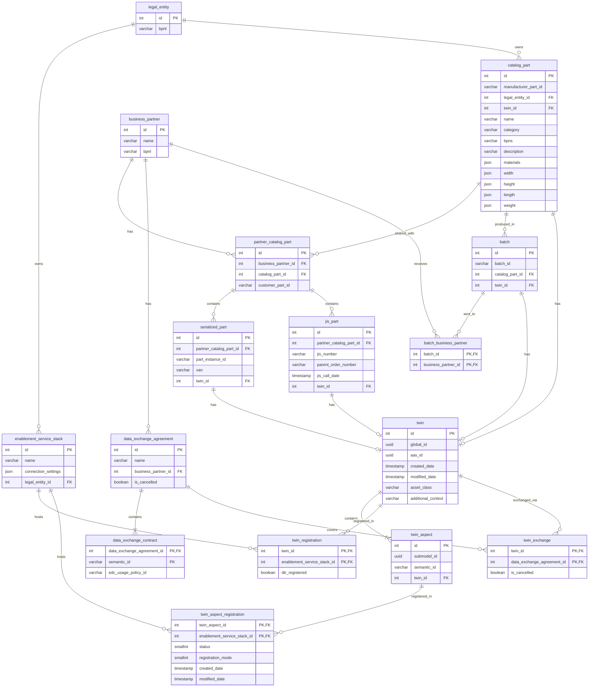

<!--
Eclipse Tractus-X - Industry Core Hub

Copyright (c) 2026 Contributors to the Eclipse Foundation
Copyright (c) 2026 Contributors to the Eclipse Foundation

See the NOTICE file(s) distributed with this work for additional
information regarding copyright ownership.

This work is made available under the terms of the
Creative Commons Attribution 4.0 International (CC-BY-4.0) license,
which is available at
https://creativecommons.org/licenses/by/4.0/legalcode.

SPDX-License-Identifier: CC-BY-4.0
-->

# Database Schema Documentation

Documentation of the Industry Core Hub database schema, including all tables, relationships, and constraints.

**Database Engine:** PostgreSQL 15.4  
**Last Updated:** 2026-02-08

## Contents

- [Overview](#overview)
- [Schemas](#schemas)
- [Core Application Tables](#core-application-tables)
  - [Legal Entity and Business Partner](#legal-entity-and-business-partner)
  - [Catalog and Parts](#catalog-and-parts)
  - [Digital Twins](#digital-twins)
  - [Data Exchange](#data-exchange)
  - [EDC Integration (ichub schema)](#edc-integration-ichub-schema)
- [Table Definitions](#table-definitions)
- [Relationships and Foreign Keys](#relationships-and-foreign-keys)
- [Entity Relationship Diagram](#entity-relationship-diagram)

---

## Overview

The Industry Core Hub database consists of multiple schemas:

- **ichub** - Core application schema for EDC connector caching
- **public** - Main application tables for manufacturing, digital twins, and data exchange
- **ichub_keycloak** - Keycloak authentication and authorization (not documented here)

## Schemas

### ichub Schema

Contains caching tables for Eclipse Dataspace Connector (EDC) integration.

### public Schema

Contains the main application data including business partners, catalog parts, digital twins, and data exchange agreements.

---

## Core Application Tables

### Legal Entity and Business Partner

#### legal_entity

Represents legal entities in the system, identified by their Business Partner Number Legal Entity (BPNL).

| Column | Type | Constraints | Description |
|--------|------|-------------|-------------|
| id | integer | PRIMARY KEY, GENERATED ALWAYS AS IDENTITY | Unique identifier |
| bpnl | varchar | NOT NULL | Business Partner Number Legal Entity |

#### business_partner

Represents business partners with their identifying information.

| Column | Type | Constraints | Description |
|--------|------|-------------|-------------|
| id | integer | PRIMARY KEY, GENERATED ALWAYS AS IDENTITY | Unique identifier |
| name | varchar | NOT NULL | Business partner name |
| bpnl | varchar | NOT NULL | Business Partner Number Legal Entity |

#### enablement_service_stack

Configuration for enablement service stacks associated with legal entities.

| Column | Type | Constraints | Description |
|--------|------|-------------|-------------|
| id | integer | PRIMARY KEY, GENERATED ALWAYS AS IDENTITY | Unique identifier |
| name | varchar | NOT NULL | Stack name |
| connection_settings | json | | Connection configuration in JSON format |
| legal_entity_id | integer | NOT NULL, FK → legal_entity(id) | Reference to legal entity |

---

### Catalog and Parts

#### catalog_part

Master catalog of parts/products managed by a legal entity.

| Column | Type | Constraints | Description |
|--------|------|-------------|-------------|
| id | integer | PRIMARY KEY, GENERATED ALWAYS AS IDENTITY | Unique identifier |
| manufacturer_part_id | varchar | NOT NULL | Manufacturer's part identifier |
| legal_entity_id | integer | NOT NULL, FK → legal_entity(id) | Owning legal entity |
| twin_id | integer | FK → twin(id) | Associated digital twin |
| name | varchar | NOT NULL | Part name |
| category | varchar | | Part category |
| bpns | varchar | | Business Partner Number Site |
| description | varchar | | Part description |
| materials | json | | Material composition in JSON |
| width | json | | Width dimensions in JSON |
| height | json | | Height dimensions in JSON |
| length | json | | Length dimensions in JSON |
| weight | json | | Weight information in JSON |

#### partner_catalog_part

Junction table linking catalog parts with business partners, including customer-specific part IDs.

| Column | Type | Constraints | Description |
|--------|------|-------------|-------------|
| id | integer | PRIMARY KEY, GENERATED ALWAYS AS IDENTITY | Unique identifier |
| business_partner_id | integer | NOT NULL, FK → business_partner(id) | Reference to business partner |
| catalog_part_id | integer | NOT NULL, FK → catalog_part(id) | Reference to catalog part |
| customer_part_id | varchar | NOT NULL, DEFAULT '' | Customer's part identifier |

#### batch

Represents batches of parts produced.

| Column | Type | Constraints | Description |
|--------|------|-------------|-------------|
| id | integer | PRIMARY KEY, GENERATED ALWAYS AS IDENTITY | Unique identifier |
| batch_id | varchar | NOT NULL | Batch identifier |
| catalog_part_id | integer | NOT NULL, FK → catalog_part(id) | Part being batched |
| twin_id | integer | FK → twin(id) | Associated digital twin |

#### batch_business_partner

Junction table linking batches to business partners.

| Column | Type | Constraints | Description |
|--------|------|-------------|-------------|
| batch_id | integer | PRIMARY KEY, NOT NULL | Reference to batch |
| business_partner_id | integer | PRIMARY KEY, NOT NULL | Reference to business partner |

#### serialized_part

Individual serialized instances of parts.

| Column | Type | Constraints | Description |
|--------|------|-------------|-------------|
| id | integer | PRIMARY KEY, GENERATED ALWAYS AS IDENTITY | Unique identifier |
| partner_catalog_part_id | integer | NOT NULL, FK → partner_catalog_part(id) | Reference to partner catalog part |
| part_instance_id | varchar | NOT NULL | Unique part instance identifier |
| van | varchar | | Vehicle Anonymized Number |
| twin_id | integer | FK → twin(id) | Associated digital twin |

#### jis_part

Just-In-Sequence (JIS) parts for manufacturing.

| Column | Type | Constraints | Description |
|--------|------|-------------|-------------|
| id | integer | PRIMARY KEY, GENERATED ALWAYS AS IDENTITY | Unique identifier |
| partner_catalog_part_id | integer | NOT NULL, FK → partner_catalog_part(id) | Reference to partner catalog part |
| jis_number | varchar | NOT NULL | JIS number |
| parent_order_number | varchar | | Parent order identifier |
| jis_call_date | timestamp | | JIS call date and time |
| twin_id | integer | FK → twin(id) | Associated digital twin |

---

### Digital Twins

#### twin

Core digital twin representation based on Asset Administration Shell (AAS) specification.

| Column | Type | Constraints | Description |
|--------|------|-------------|-------------|
| id | integer | PRIMARY KEY, GENERATED ALWAYS AS IDENTITY | Unique identifier |
| global_id | uuid | NOT NULL, DEFAULT gen_random_uuid() | Globally unique identifier |
| aas_id | uuid | NOT NULL, DEFAULT gen_random_uuid() | AAS identifier |
| created_date | timestamp | NOT NULL, DEFAULT now() AT TIME ZONE 'utc' | Creation timestamp |
| modified_date | timestamp | NOT NULL, DEFAULT now() AT TIME ZONE 'utc' | Last modification timestamp |
| asset_class | varchar | | Asset classification |
| additional_context | varchar | | Additional contextual information |

#### twin_aspect

Submodels (aspects) of digital twins based on semantic models.

| Column | Type | Constraints | Description |
|--------|------|-------------|-------------|
| id | integer | PRIMARY KEY, GENERATED ALWAYS AS IDENTITY | Unique identifier |
| submodel_id | uuid | NOT NULL, DEFAULT gen_random_uuid() | Submodel identifier |
| semantic_id | varchar | NOT NULL | Semantic model identifier (URN) |
| twin_id | integer | NOT NULL, FK → twin(id) | Parent twin |

#### twin_aspect_registration

Registration status of twin aspects with enablement service stacks.

| Column | Type | Constraints | Description |
|--------|------|-------------|-------------|
| twin_aspect_id | integer | PRIMARY KEY, NOT NULL, FK → twin_aspect(id) | Reference to twin aspect |
| enablement_service_stack_id | integer | PRIMARY KEY, NOT NULL, FK → enablement_service_stack(id) | Reference to service stack |
| status | smallint | NOT NULL, DEFAULT 0 | Registration status code |
| registration_mode | smallint | NOT NULL, DEFAULT 0 | Registration mode |
| created_date | timestamp | NOT NULL, DEFAULT now() AT TIME ZONE 'utc' | Creation timestamp |
| modified_date | timestamp | NOT NULL, DEFAULT now() AT TIME ZONE 'utc' | Last modification timestamp |

#### twin_registration

Registration of twins with Digital Twin Registry (DTR) services.

| Column | Type | Constraints | Description |
|--------|------|-------------|-------------|
| twin_id | integer | PRIMARY KEY, NOT NULL, FK → twin(id) | Reference to twin |
| enablement_service_stack_id | integer | PRIMARY KEY, NOT NULL, FK → enablement_service_stack(id) | Reference to service stack |
| dtr_registered | boolean | NOT NULL, DEFAULT false | DTR registration status |

#### twin_exchange

Links twins to data exchange agreements.

| Column | Type | Constraints | Description |
|--------|------|-------------|-------------|
| twin_id | integer | PRIMARY KEY, NOT NULL, FK → twin(id) | Reference to twin |
| data_exchange_agreement_id | integer | PRIMARY KEY, NOT NULL, FK → data_exchange_agreement(id) | Reference to agreement |
| is_cancelled | boolean | NOT NULL, DEFAULT false | Cancellation status |

---

### Data Exchange

#### data_exchange_agreement

Agreements for data exchange between partners.

| Column | Type | Constraints | Description |
|--------|------|-------------|-------------|
| id | integer | PRIMARY KEY, GENERATED ALWAYS AS IDENTITY | Unique identifier |
| name | varchar | NOT NULL | Agreement name |
| business_partner_id | integer | NOT NULL, FK → business_partner(id) | Associated business partner |
| is_cancelled | boolean | NOT NULL, DEFAULT false | Cancellation status |

#### data_exchange_contract

Specific contracts within data exchange agreements, linked to semantic models and EDC policies.

| Column | Type | Constraints | Description |
|--------|------|-------------|-------------|
| data_exchange_agreement_id | integer | PRIMARY KEY, NOT NULL, FK → data_exchange_agreement(id) | Parent agreement |
| semantic_id | varchar | PRIMARY KEY, NOT NULL | Semantic model identifier |
| edc_usage_policy_id | varchar | NOT NULL | EDC usage policy identifier |

---

### EDC Integration (ichub schema)

#### ichub.edr_connections

Caches Endpoint Data References (EDR) from EDC connector negotiations.

| Column | Type | Constraints | Description |
|--------|------|-------------|-------------|
| transfer_id | varchar | PRIMARY KEY, NOT NULL | EDC transfer process ID |
| counter_party_id | varchar | NOT NULL | Business partner BPN |
| counter_party_address | varchar | NOT NULL | EDC connector endpoint URL |
| query_checksum | varchar | NOT NULL | Checksum of query parameters |
| policy_checksum | varchar | NOT NULL | Checksum of policy configuration |
| edr_data | json | | EDR response data in JSON |
| edr_hash | varchar | | Hash of EDR data |

#### ichub.known_connectors

Caches known EDC connector endpoints for business partners.

| Column | Type | Constraints | Description |
|--------|------|-------------|-------------|
| bpnl | varchar | PRIMARY KEY, NOT NULL | Business Partner Number Legal Entity |
| connectors | json | | Array of connector URLs in JSON |
| expires_at | timestamp | NOT NULL | Cache expiration timestamp |

#### ichub.known_dtrs

Caches known Digital Twin Registry (DTR) assets and their policies.

| Column | Type | Constraints | Description |
|--------|------|-------------|-------------|
| bpnl | varchar | PRIMARY KEY, NOT NULL | Business Partner Number Legal Entity |
| edc_url | varchar | NOT NULL | EDC connector URL |
| asset_id | varchar | NOT NULL | DTR asset identifier |
| policies | json | | ODRL policies in JSON format |
| expires_at | timestamp | NOT NULL | Cache expiration timestamp |

---

## Table Definitions

### Complete Table List

**Application Tables (public schema):**

1. `legal_entity` - Legal entities by BPNL
2. `business_partner` - Business partner information
3. `enablement_service_stack` - Service stack configurations
4. `catalog_part` - Master parts catalog
5. `partner_catalog_part` - Partner-specific part mappings
6. `batch` - Part batches
7. `batch_business_partner` - Batch to partner links
8. `serialized_part` - Individual part instances
9. `jis_part` - Just-In-Sequence parts
10. `twin` - Digital twin definitions
11. `twin_aspect` - Twin submodels
12. `twin_aspect_registration` - Aspect registration status
13. `twin_registration` - Twin DTR registration
14. `twin_exchange` - Twin data exchange links
15. `data_exchange_agreement` - Data exchange agreements
16. `data_exchange_contract` - Agreement contracts

**EDC Cache Tables (ichub schema):**

1. `edr_connections` - EDR connection cache
2. `known_connectors` - Connector discovery cache
3. `known_dtrs` - DTR discovery cache

---

## Relationships and Foreign Keys

### Legal Entity Hierarchy

```
legal_entity (root)
├── enablement_service_stack
│   ├── twin_registration
│   └── twin_aspect_registration
└── catalog_part
    ├── batch
    │   └── batch_business_partner
    ├── partner_catalog_part
    │   ├── serialized_part
    │   └── jis_part
    └── twin (indirect)
```

### Business Partner Relationships

```
business_partner
├── partner_catalog_part
│   ├── serialized_part
│   └── jis_part
├── data_exchange_agreement
│   ├── data_exchange_contract
│   └── twin_exchange
└── batch_business_partner
```

### Digital Twin Relationships

```
twin (central entity)
├── twin_aspect
│   └── twin_aspect_registration
├── twin_registration
├── twin_exchange
├── catalog_part (inverse)
├── batch (inverse)
├── serialized_part (inverse)
└── jis_part (inverse)
```

### Foreign Key Constraints Summary

| Child Table | Column | References | Constraint Name |
|------------|--------|-----------|-----------------|
| catalog_part | legal_entity_id | legal_entity(id) | fk_catalog_part_legal_entitiy_id |
| catalog_part | twin_id | twin(id) | fk_catalog_part_twin_id |
| enablement_service_stack | legal_entity_id | legal_entity(id) | fk_enablement_service_stack_legal_entity_id |
| partner_catalog_part | business_partner_id | business_partner(id) | fk_partner_catalog_part_business_partner_id |
| partner_catalog_part | catalog_part_id | catalog_part(id) | fk_partner_catalog_part_catalog_part_id |
| batch | catalog_part_id | catalog_part(id) | fk_batch_catalog_part_id |
| batch | twin_id | twin(id) | fk_batch_twin_id |
| serialized_part | partner_catalog_part_id | partner_catalog_part(id) | fk_serialized_part_partner_catalog_part_id |
| serialized_part | twin_id | twin(id) | fk_serialized_part_twin_id |
| jis_part | partner_catalog_part_id | partner_catalog_part(id) | fk_jis_part_partner_catalog_part_id |
| jis_part | twin_id | twin(id) | fk_jis_part_twin_id |
| twin_aspect | twin_id | twin(id) | fk_twin_aspect_twin_id |
| twin_aspect_registration | twin_aspect_id | twin_aspect(id) | fk_twin_aspect_registration_twin_aspect_id |
| twin_aspect_registration | enablement_service_stack_id | enablement_service_stack(id) | fk_twin_aspect_registration_enablement_service_stack_id |
| twin_registration | twin_id | twin(id) | fk_twin_registration_twin_id |
| twin_registration | enablement_service_stack_id | enablement_service_stack(id) | fk_twin_registration_enablement_service_stack_id |
| twin_exchange | twin_id | twin(id) | fk_twin_exchange_twin_id |
| twin_exchange | data_exchange_agreement_id | data_exchange_agreement(id) | fk_twin_exchange_data_exchange_agreement_id |
| data_exchange_agreement | business_partner_id | business_partner(id) | fk_data_exchange_agreement_business_partner_id |
| data_exchange_contract | data_exchange_agreement_id | data_exchange_agreement(id) | fk_data_exchange_contract_data_exchange_agreement_id |

---

## Entity Relationship Diagram



---

## NOTICE

This work is licensed under the [CC-BY-4.0](https://creativecommons.org/licenses/by/4.0/legalcode).

- SPDX-License-Identifier: CC-BY-4.0
- SPDX-FileCopyrightText: 2026 LKS Next
- SPDX-FileCopyrightText: 2026 Contributors to the Eclipse Foundation
- Source URL: https://github.com/eclipse-tractusx/industry-core-hub
